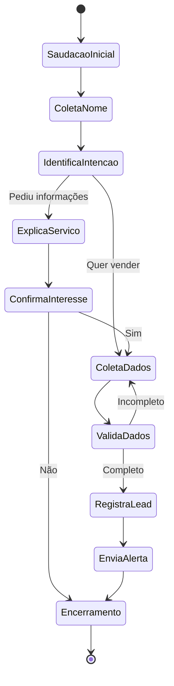

# 🏗️ Arquitetura Técnica - Ágape Invest Chatbot

> **Documentação técnica detalhada da arquitetura, padrões de design e implementação do sistema de conversação inteligente.**

## 📐 Visão Geral da Arquitetura

### Padrões Arquiteturais Implementados

- **Event-Driven Architecture**: Sistema reativo baseado em eventos de webhook
- **Microservices Pattern**: Componentes independentes com responsabilidades específicas
- **Pipeline Pattern**: Processamento sequencial de mensagens com validações
- **State Machine Pattern**: Controle de fluxo conversacional estruturado
- **Buffer Pattern**: Gestão de mensagens com Redis para performance

### Princípios de Design

- **Single Responsibility**: Cada workflow tem uma função específica
- **Separation of Concerns**: UI, lógica de negócio e persistência separados
- **Fail-Fast**: Validações precoces com tratamento de erro adequado
- **Idempotency**: Operações seguras para reprocessamento
- **Circuit Breaker**: Proteção contra cascata de falhas

## 🔄 Fluxo de Dados Detalhado

### 1. Recepção de Mensagens (Webhook Pipeline)

```
WhatsApp → Evolution API → n8n Webhook → Data Processing
```

**Componentes envolvidos:**
- **Webhook Node**: Endpoint HTTP para recepção
- **Data Extraction**: Parsing de payload JSON
- **Validation Layer**: Verificação de origem e formato

```javascript
// Estrutura do payload recebido
{
  body: {
    data: {
      key: {
        remoteJid: "5511999999999@s.whatsapp.net",
        fromMe: false
      },
      message: {
        conversation: "Texto da mensagem"
      },
      pushName: "Nome do usuário"
    },
    date_time: "2024-01-15T10:30:00Z"
  }
}
```

### 2. Processamento e Filtros

**Anti-Loop Protection:**
```javascript
// Validação fromMe para evitar loops
if (data.key.fromMe === true) {
  // Interrompe processamento
  return null;
}
```

**Content Type Filtering:**
```javascript
// Aceita apenas mensagens de texto
if (!data.message.conversation) {
  sendError("Só posso receber mensagens em formato de texto");
  return;
}
```

### 3. Sistema de Buffer Redis

**Estratégia de Buffering:**
- **Key Pattern**: `{telefone}_buffer`
- **Data Structure**: Redis List (FIFO)
- **TTL**: Configurável (padrão: 1 hora)

**Operações Redis:**
```javascript
// Push nova mensagem
LPUSH 5511999999999_buffer "Nova mensagem"

// Get mensagens do buffer
LRANGE 5511999999999_buffer 0 -1

// Cleanup após processamento
DEL 5511999999999_buffer
```

**Controle de Fluxo:**
- **Debounce Logic**: Espera 15s para agrupar mensagens
- **Deduplication**: Compara última mensagem para evitar duplicatas
- **Batch Processing**: Processa mensagens em lote para otimização

### 4. AI Agent Architecture

**Componentes do Agent:**

```yaml
AI Agent:
  Language Model: OpenAI GPT-4.1 Mini
  Memory: Buffer Window Memory (session-based)
  Tools:
    - Think Tool: Raciocínio interno
    - Supabase Tool: Registro de dados
    - Workflow Tool: Alertas para equipe
  Output Parser: Structured JSON
  Context Management: Session por telefone
```

**Prompt Engineering:**

```javascript
const systemPrompt = `
📅 Data atual: ${now}

### Persona
Você é o Téo, atendente da Ágape Invest.
- Tom: Acolhedor, claro e profissional
- Não deixar o cliente perceber que você é um bot
- Função: Qualificar interesse em antecipação de precatórios

### Fluxo de Atendimento
1. Contato inicial e coleta do nome
2. Identificação da intenção
3. Coleta de dados do precatório
4. Validação e encerramento
`;
```

### 5. Output Processing Pipeline

**Structured Output:**
```javascript
{
  "mensagens": [
    "Mensagem dividida em blocos",
    "Para melhor experiência do usuário",
    "Máximo 240 caracteres por bloco"
  ]
}
```

**Message Formatting Rules:**
- **Divisão inteligente**: Quebras naturais por pontuação
- **Formatação**: Negrito com asterisco único (*)
- **Chunk Size**: Máximo 240 caracteres
- **Line Breaks**: `\n` após pontos finais

### 6. Response Delivery System

**Humanização da Resposta:**
```javascript
// Loop com delay entre mensagens
for (const mensagem of mensagens) {
  await sendMessage(mensagem);
  await wait(2000); // 2s delay entre mensagens
}
```

## 🛢️ Gestão de Dados

### Modelo de Dados Supabase

```sql
-- Tabela principal de leads
CREATE TABLE "Agape Invest" (
    id SERIAL PRIMARY KEY,
    nome VARCHAR(255) NOT NULL,
    telefone VARCHAR(20) UNIQUE NOT NULL,
    status TEXT DEFAULT 'novo_lead',
    tipo_precatorio VARCHAR(50), -- Federal, Estadual, Municipal
    ente_devedor TEXT,
    numero_processo VARCHAR(100),
    data_criacao TIMESTAMP DEFAULT NOW(),
    data_atualizacao TIMESTAMP DEFAULT NOW(),
    origem VARCHAR(50) DEFAULT 'whatsapp_bot'
);

-- Índices para performance
CREATE INDEX idx_telefone ON "Agape Invest"(telefone);
CREATE INDEX idx_data_criacao ON "Agape Invest"(data_criacao);
CREATE INDEX idx_status ON "Agape Invest"(status);
```

### Estados do Lead

```javascript
const leadStates = {
  'novo_lead': 'Lead inicial, primeiro contato',
  'qualificando': 'Em processo de qualificação',
  'qualificado': 'Dados completos coletados',
  'contatado': 'Equipe já fez contato',
  'convertido': 'Virou cliente',
  'descartado': 'Não se qualificou'
};
```

## 🧠 Lógica de Negócio

### State Machine do Chatbot



### Validações Implementadas

**Validação de Dados do Precatório:**
```javascript
const validarDadosPrecatorio = (dados) => {
  const requeridos = [
    'tipo', // Federal, Estadual, Municipal
    'ente_devedor', // Ex: INSS, Estado de SP
    'identificador' // Número processo ou CPF
  ];
  
  return requeridos.every(campo => 
    dados[campo] && dados[campo].trim().length > 0
  );
};
```

**Sanitização de Entrada:**
```javascript
const sanitizarInput = (texto) => {
  return texto
    .trim()
    .replace(/[<>\"']/g, '') // Remove caracteres potencialmente perigosos
    .substring(0, 500); // Limita tamanho
};
```

## 🔧 Ferramentas e Integrações

### OpenAI Integration

**Configuração do Modelo:**
```json
{
  "model": "gpt-4.1-mini-2025-04-14",
  "temperature": 0.7,
  "max_tokens": 1000,
  "top_p": 0.9,
  "presence_penalty": 0.1,
  "frequency_penalty": 0.1
}
```

**Cost Optimization:**
- **Model Choice**: GPT-4.1 Mini para custo-benefício
- **Token Management**: Limite de tokens por resposta
- **Context Window**: Gerenciamento eficiente de contexto

### Evolution API Integration

**Endpoints Utilizados:**
```javascript
// Envio de mensagem
POST /message/sendText/{instance}
{
  "number": "5511999999999",
  "text": "Mensagem para envio"
}

// Webhook configuration
POST /webhook/set/{instance}
{
  "url": "https://n8n.domain.com/webhook/agape-invest",
  "events": ["messages.upsert"]
}
```

### Redis Caching Strategy

**Padrões de Cache:**
```javascript
// Buffer de mensagens
SET user:5511999999999:buffer "['msg1','msg2']" EX 3600

// Session state
SET user:5511999999999:state "coletando_dados" EX 1800

// Rate limiting
SET rate:5511999999999 1 EX 60
```

## 🔒 Segurança e Compliance

### Proteções Implementadas

**Input Validation:**
```javascript
const validateInput = (message) => {
  // Tamanho máximo
  if (message.length > 1000) return false;
  
  // Caracteres suspeitos
  const suspiciousPatterns = [
    /<script/i,
    /javascript:/i,
    /data:/i,
    /vbscript:/i
  ];
  
  return !suspiciousPatterns.some(pattern => 
    pattern.test(message)
  );
};
```

**Rate Limiting:**
```javascript
// Máximo 10 mensagens por minuto por usuário
const checkRateLimit = async (telefone) => {
  const key = `rate:${telefone}`;
  const current = await redis.incr(key);
  
  if (current === 1) {
    await redis.expire(key, 60);
  }
  
  return current <= 10;
};
```

**Data Encryption:**
- **Em trânsito**: HTTPS/TLS para todas as comunicações
- **Em repouso**: Supabase RLS (Row Level Security)
- **Logs**: Mascaramento de dados sensíveis

### LGPD Compliance

**Princípios Implementados:**
- **Minimização**: Coleta apenas dados necessários
- **Finalidade**: Uso específico para qualificação
- **Transparência**: Informação clara sobre uso dos dados
- **Consentimento**: Opt-in explícito do usuário

## ⚡ Performance e Monitoramento

### Métricas de Performance

**Response Time Targets:**
- **Webhook processing**: < 100ms
- **AI response generation**: < 3s
- **Message delivery**: < 500ms
- **Database operations**: < 200ms

### Logging Strategy

```javascript
const logLevels = {
  ERROR: 'Falhas críticas do sistema',
  WARN: 'Situações que requerem atenção',
  INFO: 'Fluxo normal de operação',
  DEBUG: 'Informações detalhadas para desenvolvimento'
};

// Exemplo de log estruturado
logger.info('Lead qualificado', {
  telefone: '5511999999999',
  tipo_precatorio: 'Federal',
  timestamp: new Date().toISOString(),
  workflow_execution_id: 'exec_123456'
});
```

### Health Checks

```javascript
const healthEndpoints = [
  { name: 'OpenAI API', url: 'https://api.openai.com/v1/models' },
  { name: 'Supabase', url: 'https://[project].supabase.co/rest/v1/' },
  { name: 'Redis', url: 'redis://localhost:6379' },
  { name: 'Evolution API', url: 'https://evolution.domain.com/status' }
];
```

## 🚀 Otimizações Implementadas

### Async Processing

```javascript
// Processamento paralelo quando possível
const processMessage = async (message) => {
  const [userCheck, rateLimitCheck] = await Promise.all([
    checkUserExists(message.phone),
    checkRateLimit(message.phone)
  ]);
  
  if (!rateLimitCheck) {
    throw new Error('Rate limit exceeded');
  }
  
  return processConversation(message);
};
```

### Memory Management

```javascript
// Limpeza automática de sessões antigas
const cleanupOldSessions = async () => {
  const oldSessions = await redis.keys('user:*:buffer');
  const expiredSessions = oldSessions.filter(key => {
    const lastActivity = redis.get(`${key}:last_activity`);
    return Date.now() - lastActivity > 24 * 60 * 60 * 1000; // 24h
  });
  
  await redis.del(...expiredSessions);
};
```

### Database Query Optimization

```sql
-- Query otimizada para busca de leads
SELECT nome, telefone, status 
FROM "Agape Invest" 
WHERE telefone = $1 
  AND data_criacao > NOW() - INTERVAL '30 days'
LIMIT 1;

-- Índice composto para queries frequentes
CREATE INDEX idx_phone_date ON "Agape Invest"(telefone, data_criacao);
```

## 🎯 Padrões de Qualidade

### Code Quality Standards

- **Error Handling**: Try-catch em todas as operações críticas
- **Validation**: Input sanitization e type checking
- **Testing**: Unit tests para lógica de negócio
- **Documentation**: JSDoc para funções complexas
- **Monitoring**: Logs estruturados e métricas

### Deployment Strategy

```yaml
# Estratégia de deploy
stages:
  development:
    - Unit tests
    - Integration tests
    - Security scan
  
  staging:
    - End-to-end tests
    - Performance tests
    - User acceptance tests
  
  production:
    - Blue-green deployment
    - Health checks
    - Monitoring alerts
    - Rollback capability
```

---

Esta arquitetura demonstra a implementação de um sistema robusto, escalável e seguro, utilizando padrões modernos de desenvolvimento e boas práticas da indústria.