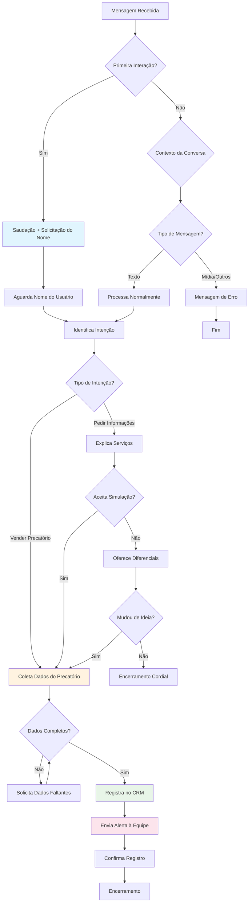

# 💬 Fluxos de Conversação e Regras de Negócio

> **Documentação detalhada dos fluxos conversacionais, regras de negócio e estratégias de qualificação de leads implementadas no chatbot.**

## 🎯 Visão Geral do Fluxo

O chatbot "Téo" da Ágape Invest segue um fluxo estruturado mas natural para qualificar leads interessados em antecipação de precatórios. O sistema utiliza IA para manter conversas humanizadas enquanto coleta dados específicos necessários para o processo comercial.

### 🎭 Persona - "Téo"

**Características da Persona:**
- **Nome**: Téo
- **Cargo**: Atendente da Ágape Invest
- **Tom**: Acolhedor, claro e profissional
- **Objetivo**: Não deixar transparecer que é um bot
- **Especialidade**: Qualificação de interessados em antecipação de precatórios

## 📊 Mapa do Fluxo Conversacional



## 🔄 Detalhamento por Etapas

### Etapa 1: Recepção e Filtros Iniciais

**Validações de Entrada:**
```javascript
// Verificação anti-loop
if (message.fromMe === true) {
  return; // Ignora mensagens próprias
}

// Verificação de conteúdo
if (!message.conversation) {
  sendErrorMessage("Só posso receber mensagens em formato de texto");
  return;
}

// Verificação de cliente humano
if (message.conversation.includes("[Ágape Invest]")) {
  // Registra interação humana
  logHumanIntervention();
}
```

### Etapa 2: Saudação e Coleta do Nome

**Trigger:** Primeira mensagem ou saudações explícitas

**Saudações Reconhecidas:**
- "oi", "olá", "bom dia", "boa tarde", "boa noite"
- "hello", "hi" (inglês básico)
- Emojis de saudação: 👋, 😊

**Resposta Padrão:**
```
"Olá, sou Téo, atendente da Ágape Invest! Para começar, por favor, qual seu nome completo?"
```

**Validações:**
- Nome deve ter pelo menos 2 palavras
- Máximo 100 caracteres
- Sem caracteres especiais maliciosos

### Etapa 3: Identificação da Intenção

**Pergunta Base:**
```
"[Nome], como posso ajudar hoje? Você deseja vender um precatório ou apenas obter informações sobre o serviço?"
```

**Classificação de Intenções via NLP:**

**Intenção: VENDER**
- Palavras-chave: "vender", "venda", "precatório", "dinheiro", "antecipação"
- Frases: "quero vender", "tenho um precatório", "preciso de dinheiro"
- Score mínimo: 0.7

**Intenção: INFORMAÇÕES**
- Palavras-chave: "informação", "saber", "conhecer", "explicar", "como funciona"
- Frases: "queria saber", "como vocês funcionam", "me explica"
- Score mínimo: 0.6

### Etapa 4A: Fluxo de Informações

**Script de Explicação:**
```
"Claro! Nós compramos precatórios federais, estaduais e municipais. 

O processo é rápido, simples e seguro:
• Analisamos os documentos e o processo em um prazo médio de 7 a 10 dias úteis
• Se aprovado, realizamos o pagamento no mesmo dia da assinatura do contrato
• Não cobramos nenhuma taxa

Com base nisso, você gostaria de iniciar uma simulação para a venda?"
```

**Após Explicação - Opções:**

**Se SIM para simulação:** → Vai para Etapa 4B
**Se NÃO:** → Oferece diferenciais

**Diferenciais da Ágape Invest:**
```
"Posso compartilhar alguns dos nossos diferenciais:

✓ Ética e segurança jurídica
✓ Processo ágil (7-10 dias)
✓ Melhor proposta do mercado
✓ Mais de 4 anos sem reclamações no Reclame Aqui
✓ Pagamento no dia da assinatura

Gostaria de seguir com a avaliação do seu precatório?"
```

### Etapa 4B: Coleta de Dados do Precatório

**Dados Obrigatórios:**
1. **Tipo de Precatório**: Federal, Estadual ou Municipal
2. **Ente Devedor**: Ex: INSS, Estado de São Paulo, Prefeitura de...
3. **Identificação**: Número do processo OU CPF do titular

**Script de Solicitação:**
```
"Perfeito! Para que eu possa te direcionar ao especialista correto, preciso de três informações sobre o seu precatório:

• É Estadual, Municipal ou Federal?
• Qual é o ente devedor (ex: INSS, Estado de São Paulo, etc.)?
• Qual o número do processo ou o seu CPF?"
```

**Validação Inteligente:**

```javascript
const validarDadosPrecatorio = (resposta) => {
  const dados = {
    tipo: null,
    ente_devedor: null,
    identificador: null
  };
  
  // Detectar tipo
  if (/federal|inss|união/i.test(resposta)) {
    dados.tipo = 'Federal';
  } else if (/estadual|estado/i.test(resposta)) {
    dados.tipo = 'Estadual';
  } else if (/municipal|prefeitura|município/i.test(resposta)) {
    dados.tipo = 'Municipal';
  }
  
  // Detectar CPF
  const cpfPattern = /\d{3}\.?\d{3}\.?\d{3}-?\d{2}/;
  if (cpfPattern.test(resposta)) {
    dados.identificador = resposta.match(cpfPattern)[0];
  }
  
  // Detectar número de processo
  const processoPattern = /\d{7}-\d{2}\.\d{4}\.\d\.\d{2}\.\d{4}/;
  if (processoPattern.test(resposta)) {
    dados.identificador = resposta.match(processoPattern)[0];
  }
  
  return dados;
};
```

### Etapa 5: Validação e Completude

**Lógica de Validação:**
```javascript
const verificarCompletude = (dados) => {
  const camposObrigatorios = ['tipo', 'ente_devedor', 'identificador'];
  const faltantes = [];
  
  camposObrigatorios.forEach(campo => {
    if (!dados[campo] || dados[campo].trim() === '') {
      faltantes.push(campo);
    }
  });
  
  return faltantes;
};
```

**Mensagens para Dados Incompletos:**
```javascript
const mensagensFaltantes = {
  tipo: "Qual o tipo do precatório (Federal, Estadual ou Municipal)?",
  ente_devedor: "Qual é o ente devedor (ex: INSS, Estado de SP)?",
  identificador: "Qual o número do processo ou seu CPF?"
};
```

### Etapa 6: Registro e Finalização

**Ações Automáticas:**
1. **Registro no Supabase** com dados completos
2. **Disparo de alerta** para equipe comercial
3. **Confirmação** para o cliente
4. **Encerramento** da conversa

**Script de Finalização:**
```
"Obrigado! Suas informações foram registradas com sucesso. 

Em breve, um especialista da Ágape Invest entrará em contato com você para prosseguir com a análise do seu precatório."
```

## 🛡️ Regras de Negócio

### Horário de Funcionamento
```javascript
const horarioFuncionamento = {
  segunda: { inicio: '08:00', fim: '18:00' },
  terca: { inicio: '08:00', fim: '18:00' },
  quarta: { inicio: '08:00', fim: '18:00' },
  quinta: { inicio: '08:00', fim: '18:00' },
  sexta: { inicio: '08:00', fim: '18:00' },
  sabado: { inicio: '08:00', fim: '12:00' },
  domingo: null // Não atende
};
```

### Rate Limiting
- **Máximo 10 mensagens por minuto** por usuário
- **Bloqueio temporário de 5 minutos** após limite
- **Alerta** para possível spam após 20 mensagens/hora

### Controle de Qualidade
```javascript
const regrasQualidade = {
  tamanhoMensagem: {
    minimo: 1,
    maximo: 1000
  },
  caracteresSuspeitos: [
    '<script>', 'javascript:', 'data:', 'vbscript:'
  ],
  palavrasProibidas: [
    // Lista de palavras ofensivas ou spam
  ]
};
```

### Prevenção de Loops
```javascript
// Evita responder a próprias mensagens
if (message.fromMe) return;

// Detecta mensagens duplicadas
const ultimaMensagem = await getUltimaMensagem(telefone);
if (message.text === ultimaMensagem) {
  return; // Não processa duplicata
}

// Limite de tentativas para dados incompletos
const tentativas = await getTentativasColeta(telefone);
if (tentativas > 3) {
  encerrarConversa("Vou transferir para um atendente humano");
}
```

## 📈 Métricas de Qualificação

### KPIs do Fluxo Conversacional

**Taxa de Conversão por Etapa:**
- Saudação → Nome: 85%
- Nome → Intenção: 78%
- Intenção → Dados: 65% (venda direta), 45% (após informações)
- Dados → Qualificado: 72%

**Tempo Médio por Etapa:**
- Coleta do nome: 30 segundos
- Identificação da intenção: 45 segundos
- Explicação de serviços: 2 minutos
- Coleta de dados: 3 minutos
- **Total médio**: 6 minutos para lead qualificado

**Principais Pontos de Abandono:**
1. **Após explicação** (22% abandono)
2. **Durante coleta de dados** (18% abandono)
3. **Após solicitação do nome** (12% abandono)

## 🔧 Tratamento de Casos Especiais

### Mensagens Fora do Escopo
```javascript
const mensagensForaEscopo = [
  "Desculpe, sou especialista em precatórios. Posso te ajudar com informações sobre antecipação de precatórios?",
  "Minha função é auxiliar com dúvidas sobre precatórios. Tem algum precatório que gostaria de avaliar?",
  "Foco em assuntos relacionados a precatórios. Como posso te ajudar nessa área?"
];
```

### Linguagem Ofensiva ou Spam
```javascript
if (detectarLinguagemOfensiva(mensagem)) {
  return "Mantenho sempre um atendimento respeitoso. Como posso te ajudar com precatórios?";
}

if (detectarSpam(mensagem)) {
  aplicarRateLimit(telefone);
  return; // Ignora mensagem
}
```

### Solicitações de Atendimento Humano
```javascript
const palavrasChaveHumano = [
  "humano", "pessoa", "atendente", "operador", 
  "falar com alguém", "não é bot"
];

if (detectarSolicitacaoHumana(mensagem)) {
  const mensagem = `
    Entendo que prefere falar com uma pessoa. 
    Vou registrar seu interesse e um especialista 
    entrará em contato em breve.
    
    Para isso, preciso apenas confirmar seu telefone: ${telefone}
  `;
  
  registrarSolicitacaoHumana(telefone);
  alertarEquipe(telefone, "Solicitação de atendimento humano");
}
```

## 🎨 Personalização da Conversa

### Adaptação ao Perfil do Cliente
```javascript
const adaptarTom = (perfil) => {
  switch(perfil.formalidade) {
    case 'formal':
      return {
        tratamento: 'senhor/senhora',
        despedida: 'Atenciosamente'
      };
    case 'casual':
      return {
        tratamento: 'você',
        despedida: 'Até mais!'
      };
  }
};
```

### Contextualização por Horário
```javascript
const saudacaoPorHorario = (hora) => {
  if (hora < 12) return "Bom dia";
  if (hora < 18) return "Boa tarde";
  return "Boa noite";
};
```

### Memória de Conversas Anteriores
```javascript
// Reconhece clientes que já interagiram
if (clienteExistente) {
  return `Olá novamente, ${nome}! Como posso te ajudar hoje?`;
}
```

## 🔍 Debugging e Logs

### Logs Estruturados
```javascript
logger.info('Fluxo conversacional', {
  telefone,
  etapa: 'coleta_dados',
  dados_coletados: {
    nome: true,
    tipo_precatorio: true,
    ente_devedor: false,
    identificador: false
  },
  tentativa: 2,
  timestamp: new Date().toISOString()
});
```

### Métricas em Tempo Real
- Conversas ativas
- Taxa de abandono por etapa
- Tempo médio de qualificação
- Volume de leads gerados
- Satisfação estimada (baseada em conclusão do fluxo)

---

Este fluxo demonstra um sistema de conversação inteligente que combina automação eficiente com qualificação precisa, maximizando a conversão de visitantes em leads qualificados para a equipe comercial.